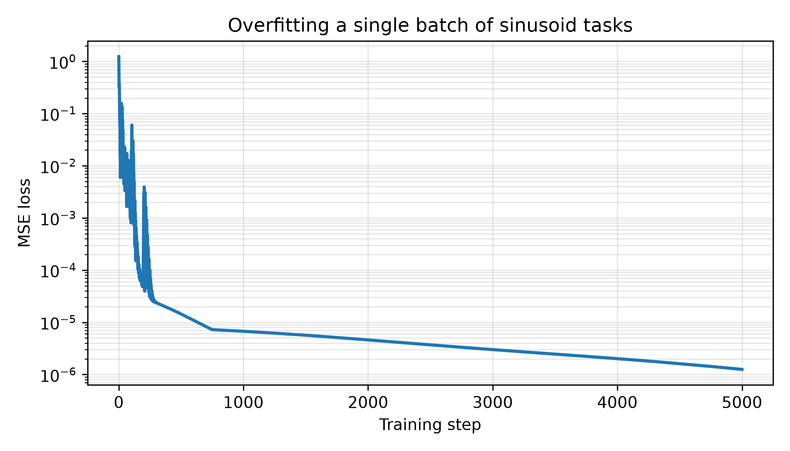
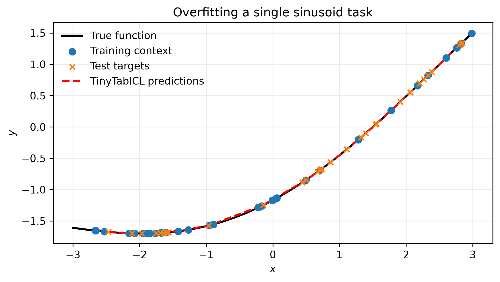
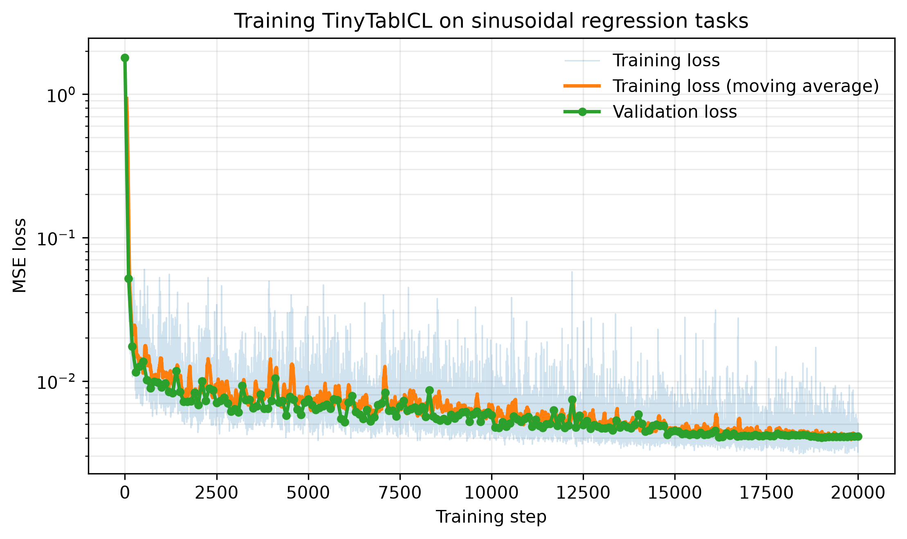
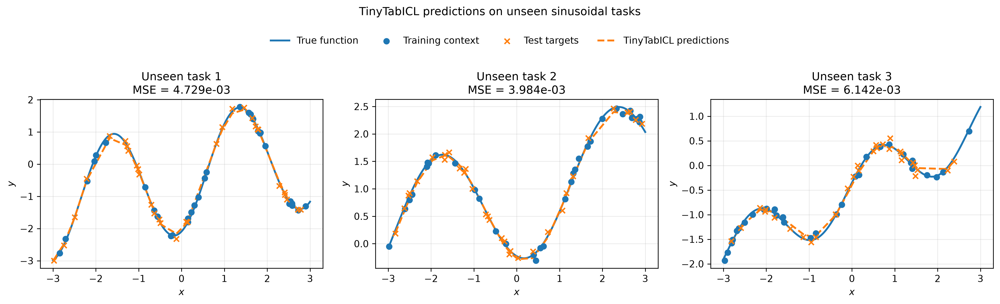

# Introduction
Tabular foundation models (TFMs) are attracting a lot of attention (no pun intended). In this post, I want to understand what happens under the hood of [TabICLv2](https://www.alphaxiv.org/abs/2602.11139), an open-source TFM developed by the SODA team at Inria. Other models, such as TabPFN from Prior Labs, follow the same broad idea: pretrain a Transformer on millions of synthetic tabular prediction tasks, then use in-context learning to solve a new task without updating the model's weights.

At inference time, the model receives the labeled training rows as context and predicts the labels or target values of unseen rows. The model conditions on an entire training set, but it does not run gradient descent or fit new parameters for that dataset. TabICLv2 supports classification and regression and handles numerical and categorical features, missing values, and outliers.

My goal here is not to reproduce the full system. Instead, I focus on the architectural ideas while deliberately omitting several engineering components of the official implementation. I will implement a small version of its three-stage architecture: a column encoder, a row encoder, and a dataset-wise Transformer that performs in-context learning. I will then train it on a controlled synthetic prior and test whether it actually learns to make better predictions as the context set grows.

I used the official [NanoTabICL](https://github.com/soda-inria/nanotabicl/) and [TabICL](https://github.com/soda-inria/tabicl) implementations to understand what's going on. 

# Formal definition

TabICL and TabPFN are Prior-Fitted Networks (PFNs). Prior-Fitted Networks were, to the best of my knowledge, introduced by [Transformers Can Do Bayesian Inference](https://openreview.net/forum?id=KSugKcbNf9). It was further developed in [TabPFN: A Transformer That Solves Small Tabular Classification Problems in a Second](https://openreview.net/forum?id=cp5PvcI6w8_), and [TabICL: A Tabular Foundation Model for In-Context Learning](https://arxiv.org/abs/2505.19307).

The key idea is to train a transformer on millions of synthetic datasets sampled from a prior distribution over tabular tasks. Assume that datasets are generated as 

$$
f \sim p(f), \quad \mathcal{D} = \{(x_i, y_i)\}_{i=1}^N, \quad y_i = f(x_i) + \epsilon\,.
$$

The quantity we care about when predicting a new point is the posterior predictive distribution (PPD)

$$
p(y^{\star} | x^{\star}, \mathcal{D}) = \int p(y^{\star} | x^{\star}, f) p(f | \mathcal{D}) df\,,
$$

where $p(f | \mathcal{D})$ is the posterior distribution over functions given the training data. The PPD is intractable in general, but we can approximate it with a transformer trained to predict $y^{\star}$ given $x^{\star}$ and $\mathcal{D}$. The transformer learns to perform Bayesian inference by conditioning on the training set and producing predictions for new inputs.

For more details, I recommend reading the original papers and the recent technical reports.

# Architecture

I think that the architecture can be divided into the following main steps:

1. Embedding step: it includes normalization, feature grouping, linear embedding of the inputs and training outputs for ICL
2. Column attention: several blocks of self-attentions with induced points applied to the columns
3. Row attention: several blocks of self-attentions applied to the rows (concatenated with extra CLS tokens)
4. ICL blocks: several self-attention blocks again but those perform ICL
5. Final output projection

It what follows, I will focus on regression.

## Feature grouping

After normalization, feature grouping is performed. Before this step, we have a tensor `x` with shape `x.shape = (batch, rows, columns)`. Feature grouping adds a new dimension: `(batch, rows, columns, feature_group_size)`. Each scalar feature value is replaced by a small vector containing values gathered from several columns of the same row.

For instance, assume that `x.shape = (1, 100, 5)` and `feature_group_size = 3`. Let `[x_0, x_1, x_2, x_3, x_4]` be a given row. Feature grouping produces

$$
\begin{bmatrix}
x_0 & x_1 & x_3\\
x_1 & x_2 & x_4\\
x_2 & x_3 & x_0\\
x_3 & x_4 & x_1\\
x_4 & x_0 & x_2\\
\end{bmatrix}
$$

Each column is represented by a vector of three values. Thanks to this, the first linear embedding layer receives information from multiple columns instead of embedding every column independently.

For a group size $n_g$, the offsets are $o_i = 2^i - 1$ for $i = 0, \dots, n_g - 1$. In our case, with $n_g = 3$, this gives three offsets $[0, 1, 3]$. For each offset $o$, the column indices are computed as `(arange(n_cols) + offset) % n_cols`. In our case, this gives:

- Offset $0$: `(arange(5) + 0) % 5` -> `[0, 1, 2, 3, 4]`
- Offset $1$: `(arange(5) + 1) % 5` -> `[1, 2, 3, 4, 0]`
- Offset $2$: `(arange(5) + 2) % 5` -> `[3, 4, 0, 1, 2]`.

By stacking the three slices `x[..., [0, 1, 2, 3, 4]]`, `x[..., [1, 2, 3, 4, 0]]`, and `x[..., [3, 4, 0, 1, 2]]`, you get the final tensor with shape `(batch, rows, columns, 3)`.

After feature grouping, a linear layer projects each feature group into the model’s embedding space. This operation is applied to the entire input tensor x, which contains both training and test rows. The labels y, which are available only for the training rows, are embedded separately and added to the corresponding training-row embeddings. The test-row embeddings receive no label information.

## Column attention with inducing points

At this stage, x has shape `x.shape = (batch, rows, columns, d_model)` where `d_model` is the embedding dimension of the model. I'm going to use the same name `x` at each step of the architecture by the way. 

The aim of column attention is to apply attention in each column independently. In tabular problems, the number of rows can be large and performing vanilla attention would be quadratic in the number of rows. To circumvent this issue, the authors leverage self-attention with inducing points. 

It consists in introducing $M << n_\mathrm{rows}$ learnable latent queries of dimensions $d_model$. It works in two steps: compression and decompression. 

The input tensor is first reshaped into `(batch * columns, rows, d_model)` so that each column of each dataset becomes an independent sequence. Attention is then performed across the rows within each sequence.

During the compression step, the $M$ inducing points act as querieswhile the row representations act as keys and values:

$$
H = \mathrm{Attention}(I, X, X)
$$

where $I$ denotes the inducing points. This produces a compressed representation with shape `(batch * columns, M, d_model)`. 

During decompression, the original row representations act as queries, while the compressed representations act as keys and values:

$$
X' = \mathrm{Attention}(X, H, H)
$$

The result has shape `(batch * columns, rows, d_model)` and is rearranged back to `(batch, rows, columns, d_model)`.

<div class="not-prose my-6 rounded-lg border border-yellow-400 bg-yellow-50 px-4 py-3 text-yellow-900 dark:border-yellow-500/60 dark:bg-yellow-950/40 dark:text-yellow-100">
  <strong>Side note.</strong> I think that this kind of block is also called ISAB (Induced Set Attention Block), introduced in the 
  <a
  href="https://proceedings.mlr.press/v97/lee19d/lee19d.pdf"
  target="_blank"
  rel="noopener noreferrer"
  class="underline"
>
Set Transformer paper.
</a>
The learnable latent queries also exist in the 
<a
    href="https://proceedings.mlr.press/v139/jaegle21a/jaegle21a.pdf"
    target="_blank"
    rel="noopener noreferrer"
    class="underline"
  >Perceiver paper</a> architecture introduced by DeepMind. Unlike ISAB, the Perceiver applies several self-attention layers in the latent space before optionally projecting the information back to the inputs (Perceiver IO).
</div>

## Row attention 

After several column attention blocks, the features pass through several row attention blocks. Row attention is essentially multi-head self-attention applied to each row independently. At this stage, the tensor has a shape `(batch, rows, columns, d_model)` and it is reshaped into `(batch * rows, columns, d_model), making the columns the sequence dimension.

Unlike column attention, no inducing points are used. Since tabular datasets contain far fewer columns than rows, the quadratic complexity of self-attention remains manageable. This allows the model to directly capture interactions between the features of each individual sample. After the attention and feed-forward layers, the tensor is reshaped back to `(batch, rows, columns, d_model)` before being passed to the next block.

The row attention block is thus identical to a standard Transformer encoder block (multi-head self-attention + residual connections + layer normalization + feed-forward network), except that it operates independently on each row after reshaping.

Before entering the first row attention block, four learnable `[CLS]` tokens are prepended to every row. These tokens are concatenated with the feature representations produced by the column transformer, yielding a sequence of columns + 4 tokens for each row. The row attention blocks jointly process the feature and `[CLS]` tokens, allowing the latter to aggregate information from all features through self-attention.

After the final row attention block, only the four `[CLS]` representations are kept and concatenated, producing a tensor of shape `(batch, rows, 4 * d_model)`, which is passed to the ICL transformer.

## ICL attention

After the row attention stage, every row is represented by a single embedding summarizing all its features. The goal of the ICL stage is to allow test examples to retrieve useful information from the labeled training examples.

The feature tensor has shape `(batch, rows, d_model)`. Unlike the previous attention blocks, the rows are not processed independently, instead, attention is applied across the rows themselves. And since the labels of the test rows are unknown, information should only flow from the training rows toward the test rows. In other words, the keys and values are restricted to the training rows, and during the final ICL block, only the test rows are queried.

## Additional perks

That's it for the principal architecture: feature grouping, induced column attention, row attention, and dataset-wise ICL attention. But there are other details worth mentioning: 
- **QASSMax** (Query-Aware Scalable Softmax). Used in the column and ICL transformer blocks, QASSMax modifies the query vectors with a learnable transformation before computing attention. The transformation depends on both the context size and the query content, allowing the model to adapt the effective attention temperature and maintain sharp attention distributions when processing datasets of varying sizes.
- **Multiple row-level `[CLS]` tokens**: I mentioned this in the above sections but it's worth emphasizing again that instead of using a single `[CLS]` token to aggregate the feature representations of a row, TabICLv2 prepends four learnable `[CLS]` tokens to each row before the row transformer.
- **Labels injected twice**: I didn't really mention this clearly in the above section, I think. Training labels are incorporated at two stages of the network. They are first embedded and added to the input feature embeddings before the column and row transformers, allowing the row representations to encode feature-label relationships. The labels are then embedded again before the ICL transformer so that dataset-level attention has direct access to the supervision signal when retrieving relevant training examples.
- **Column attention reads only the training rows**: The column transformer is applied exclusively to the labeled training rows. Since this stage performs attention across the row dimension, excluding the test rows reduces computation while still allowing them to retrieve information from the encoded training set during the subsequent ICL stage. I think that this was not the case in the first version of TabICL.
- **The final ICL block is asymmetric**: The last ICL block is implemented as cross-attention rather than self-attention: only the test-row representations are used as queries, while the training-row representations provide the keys and values. Since the model only needs to produce predictions for the test rows, this avoids unnecessary computation on the training rows.

# Implementation

The aim is to obtain a model that we can create as follows:

```python
model = TinyTabICL(out_dim=1, d_model=128)
```

Given a batch of datasets, the model can be called with:

```python
y_pred = model(X, y)
```

where `X` contains the train and test rows, while `y` only contain the training rows. The model uses the labeled training rows as context and returns predictions for the test rows. More precisely:

- `X`:      `(batch_size, num_train + num_test, num_features)`
- `y`:      `(batch_size, num_train)`
- `y_pred`: `(batch_size, num_test, out_dim)`

For scalar regression, we set out_dim=1. The model can be implemented as an nn.Module with the following interface:

```python
class TinyTabICL(nn.Module):
    """Tiny squeezy TabICL model."""

    def __init__(
        self,
        out_dim: int,
        d_model: int = 128,
        num_heads_col: int = 8,
        num_heads_row: int = 8,
        num_heads_icl: int = 8,
        num_col_blocks: int = 3,
        num_row_blocks: int = 3,
        num_icl_blocks: int = 3,
        num_inducing: int = 128,
        num_cls_cols: int = 4,
        feature_group_size: int = 3,
    ):
        super().__init__()
        ...

    def forward(self, x: torch.Tensor, y: torch.Tensor) -> torch.Tensor: 
        ...
```

The main hyperparameter is d_model, which controls the dimension of the feature representations throughout the column and row transformers. For each stage (column attention, row attention, and ICL attention) we specify both the number of Transformer blocks and the number of attention heads.

The remaining parameters control architecture-specific details:
- `num_inducing` is the number of learnable inducing tokens used by the column transformer
- `num_cls_cols` is the number of learnable `[CLS]` tokens prepended to each row before row attention. 
- `feature_group_size` determines how many feature values are grouped together before the initial linear projection.

## Forward pass

I would like to go through the forward method step by step, sequentially. Let's start with this:

```python
def forward(self, x: torch.Tensor, y: torch.Tensor) -> torch.Tensor:
    batch_size, num_rows, num_cols = x.shape
    y_batch_size, num_train = y.shape

    if y_batch_size != batch_size:
        raise ValueError(
            f"Batch-size mismatch: x has {batch_size}, y has {y_batch_size}."
        )

    # input preprocessing
    ...

    # input embedding
    ...

    # column attention
    ...

    # row attention
    ...

    # ICL attention
    ...

    # output projection
    ...
```

The complete implementation is given in the sequel of this section.

### Input preprocessing

The input preprocessing step consists of normalizing the features and applying the feature-grouping strategy. I took both operations directly from the NanoTabICL implementation.

The features are standardized using statistics computed from the training rows only:

```python
x = (x - x[:, :num_train].mean(dim=1, keepdim=True)) / (
    x[:, :num_train].std(dim=1, unbiased=False, keepdim=True) + 1e-8
)
```

The mean and standard deviation are computed independently for every dataset and every feature.

We then apply feature grouping:

```python
idxs = torch.arange(num_cols, dtype=torch.long, device=x.device)
x = torch.stack(
    [
        x[:, :, (idxs + (2**i - 1)) % num_cols]
        for i in range(self.feature_group_size)
    ],
    dim=-1,
)
```

Before this operation, x has shape `(batch_size, num_rows, num_cols)`. After feature grouping, its shape becomes `(batch_size, num_rows, num_cols, feature_group_size)`.

### Input embedding

Each feature group is then projected into the model embedding space:

```python
x_proj = self.proj_x(x)
```

The resulting tensor has shape `(batch, rows, columns, d_model)`. The labels are embedded separately and added only to the training-row representations:

```python
x_proj[:, :num_train] += self.proj_y(y[:, :, None, None])
```

The two singleton dimensions are added so that the label embedding can be broadcast across all columns of the corresponding row. The test rows receive no label information.

### Column attention

Column attention processes each column as an independent sequence over the rows. We therefore move the column dimension next to the batch dimension and merge both dimensions:

```python
x_proj = x_proj.permute(0, 2, 1, 3).reshape(
    batch_size * num_cols,
    num_rows,
    -1,
)
```

The shape changes from `(batch, rows, columns, d_model)` to `(batch * columns, rows, d_model)`. The induced Transformer blocks are then applied:

```python
for block in self.col_blocks:
    train_context = x_proj[:, :num_train]
    x_proj = block(x_proj, train_context)
```

All rows are used as queries, but the inducing tokens summarize only the training rows. Consequently, the test rows can retrieve information from the training context without contributing to it.

After the column blocks, we restore the original table layout:

```python
x_proj = x_proj.reshape(
    batch_size,
    num_cols,
    num_rows,
    -1,
).permute(0, 2, 1, 3)
```

The tensor once again has shape `(batch, rows, columns, d_model)`.

### Row attention

Before applying row attention, we prepend the learnable [CLS] tokens to every row:

```python
x_proj = torch.cat(
    [self.row_cls_tokens.expand(batch_size, num_rows, -1, -1), x_proj],
    dim=2,
)
```

These tokens are inserted along the column dimension and will be used to summarize the feature representations of each row. We then merge the batch and row dimensions so that each row becomes an independent sequence:

```python
num_tokens = self.num_cls_cols + num_cols
x_proj = x_proj.reshape(
    batch_size * num_rows,
    num_tokens,
    -1,
)
```

The intermediate row blocks apply ordinary self-attention to all feature and [CLS] tokens:

```python
for block in self.row_blocks[:-1]:
    x_proj = block(x_proj)
```

In the final row block, only the [CLS] tokens are used as queries:

```python
cls_queries = x_proj[:, : self.num_cls_cols]
x_proj = self.row_blocks[-1](cls_queries, x_proj)
```

Finally, we restore the table dimensions and concatenate the [CLS] representations:

```python
x_proj = x_proj.reshape(
    batch_size,
    num_rows,
    self.num_cls_cols,
    -1,
)

x_proj = self.row_norm(x_proj).flatten(-2, -1)
```

### ICL attention

Before the ICL Transformer, the training labels are embedded a second time, now directly in the ICL embedding space:

```python
x_proj[:, :num_train] += self.proj_y_icl(y[:, :, None])
```

The intermediate ICL blocks update every row, but only the training rows are used as keys and values:

```python
for block in self.icl_blocks[:-1]:
    x_proj = block(
        x_proj,
        x_proj[:, :num_train],
    )
```

The final ICL block is asymmetric. Only the test rows are used as queries, while the training rows provide the context:

```python
x_proj = self.icl_blocks[-1](
    x_proj[:, num_train:],
    x_proj[:, :num_train],
)
```

The final normalization and MLP map these representations to predictions:

```python
return self.out_mlp(self.out_norm(x_proj))
```

## Complete implementation

The complete tiny squeezy TabICL v2 model is shown below. You can find all the steps discussed above in the forward method.

This version omits some implementation details from TabICLv2, such as QASSMax, RoPE and the classification-specific embeddings, in order to focus on the core architecture.

<details>
<summary>TinyTabICL model implementation (click to expand)</summary>

```python
import torch
import torch.nn as nn

class TinyTabICL(nn.Module):
    """Tiny squeezy TabICL model."""

    def __init__(
        self,
        out_dim: int,
        d_model: int = 128,
        num_heads_col: int = 8,
        num_heads_row: int = 8,
        num_heads_icl: int = 8,
        num_col_blocks: int = 3,
        num_row_blocks: int = 3,
        num_icl_blocks: int = 3,
        num_inducing: int = 128,
        num_cls_cols: int = 4,
        feature_group_size: int = 3,
    ):
        super().__init__()
        self.feature_group_size = feature_group_size
        self.num_cls_cols = num_cls_cols

        icl_dim = d_model * num_cls_cols

        self.proj_x = nn.Linear(feature_group_size, d_model)

        # Labels are injected both before the column transformer and before ICL
        self.proj_y = nn.Linear(1, d_model)
        self.proj_y_icl = nn.Linear(1, icl_dim)

        self.col_blocks = nn.ModuleList(
            InducedTransformerBlock(
                d_model=d_model,
                num_heads=num_heads_col,
                num_inducing=num_inducing,
                mlp_ratio=4.0,
                dropout=0.0,
            )
            for _ in range(num_col_blocks)
        )

        self.row_blocks = nn.ModuleList(
            TransformerBlock(
                d_model=d_model,
                num_heads=num_heads_row,
                mlp_ratio=4.0,
                dropout=0.0,
            )
            for _ in range(num_row_blocks)
        )

        self.icl_blocks = nn.ModuleList(
            TransformerBlock(
                d_model=icl_dim,
                num_heads=num_heads_icl,
                mlp_ratio=4.0,
                dropout=0.0,
            )
            for _ in range(num_icl_blocks)
        )

        # These tokens will summarize the features of each row, the paper uses 4 CLS tokens
        self.row_cls_tokens = nn.Parameter(
            0.02 * torch.randn(1, 1, num_cls_cols, d_model)
        )

        self.row_norm = nn.LayerNorm(d_model)
        self.out_norm = nn.LayerNorm(icl_dim)
        self.out_mlp = nn.Sequential(
            nn.Linear(icl_dim, icl_dim * 2),
            nn.GELU(),
            nn.Linear(icl_dim * 2, out_dim),
        )

    def forward(self, x: torch.Tensor, y: torch.Tensor) -> torch.Tensor:
        batch_size, num_rows, num_cols = x.shape
        y_batch_size, num_train = y.shape

        if y_batch_size != batch_size:
            raise ValueError(
                f"Batch-size mismatch: x has {batch_size}, y has {y_batch_size}."
            )

        # Normalization, use only the training rows for statistics (of course)
        x = (x - x[:, :num_train].mean(dim=1, keepdim=True)) / (
            x[:, :num_train].std(dim=1, unbiased=False, keepdim=True) + 1e-8
        )

        # Feature grouping
        idxs = torch.arange(num_cols, dtype=torch.long, device=x.device)
        x = torch.stack(
            [
                x[:, :, (idxs + (2**i - 1)) % num_cols]
                for i in range(self.feature_group_size)
            ],
            dim=-1,
        )

        # Embedding and label injection
        x_proj = self.proj_x(x)
        x_proj[:, :num_train] += self.proj_y(y[:, :, None, None])

        # Column attention
        ## Reshape for column attention
        x_proj = x_proj.permute(0, 2, 1, 3).reshape(
            batch_size * num_cols,
            num_rows,
            -1,
        )

        for block in self.col_blocks:
            # All rows are queried, but the inducing tokens summarize training rows only
            train_context = x_proj[:, :num_train]
            x_proj = block(x_proj, train_context)

        ## Reshape back
        x_proj = x_proj.reshape(
            batch_size,
            num_cols,
            num_rows,
            -1,
        ).permute(0, 2, 1, 3)

        # Row attention
        ## Add learnable tokens that will summarize each row
        x_proj = torch.cat(
            [self.row_cls_tokens.expand(batch_size, num_rows, -1, -1), x_proj],
            dim=2,
        )

        ## Reshape for row attention
        num_tokens = self.num_cls_cols + num_cols
        x_proj = x_proj.reshape(
            batch_size * num_rows,
            num_tokens,
            -1,
        )

        for block in self.row_blocks[:-1]:
            x_proj = block(x_proj)

        ## In the last block, only the CLS tokens need updated representations
        cls_queries = x_proj[:, : self.num_cls_cols]
        x_proj = self.row_blocks[-1](cls_queries, x_proj)

        ## Reshape back
        x_proj = x_proj.reshape(
            batch_size,
            num_rows,
            self.num_cls_cols,
            -1,
        )

        ## Concatenate the CLS tokens into one fixed-size row representation
        x_proj = self.row_norm(x_proj).flatten(-2, -1)

        # ICL attention
        ## Inject labels again at the dimension used by the ICL transformer
        x_proj[:, :num_train] += self.proj_y_icl(y[:, :, None])

        for block in self.icl_blocks[:-1]:
            # Every row is queried, but only training rows provide keys and values
            x_proj = block(
                x_proj,
                x_proj[:, :num_train],
            )

        ## The final block only computes representations for the test rows
        x_proj = self.icl_blocks[-1](
            x_proj[:, num_train:],
            x_proj[:, :num_train],
        )

        # Output projection
        return self.out_mlp(self.out_norm(x_proj))
```
</details>

<details>
<summary>Transformer block implementation (click to expand)</summary>

```python
import torch
import torch.nn as nn


class TransformerBlock(nn.Module):
    """Classic transformer block with optional cross attention."""

    def __init__(
        self,
        d_model: int,
        num_heads: int,
        mlp_ratio: float,
        dropout: float = 0.0,
    ):
        super().__init__()
        self.norm1 = nn.LayerNorm(d_model)
        self.norm2 = nn.LayerNorm(d_model)
        self.attn = nn.MultiheadAttention(d_model, num_heads, dropout, batch_first=True)

        hidden_dim = int(mlp_ratio * d_model)
        self.ffn = nn.Sequential(
            nn.Linear(d_model, hidden_dim), nn.GELU(), nn.Linear(hidden_dim, d_model)
        )

    def forward(
        self, x: torch.Tensor, context: torch.Tensor | None = None
    ) -> torch.Tensor:
        q = self.norm1(x)

        if context is None:
            kv = q
        else:
            kv = self.norm1(context)

        attn_output, _ = self.attn(
            q,
            kv,
            kv,
            need_weights=False,
        )
        x = x + attn_output

        x = x + self.ffn(self.norm2(x))
        return x
```
</details>

<details>
<summary>Induced Transformer block implementation (click to expand)</summary>

```python
class InducedTransformerBlock(nn.Module):
    """Transformer block with induced tokens."""

    def __init__(
        self,
        d_model: int,
        num_heads: int,
        num_inducing: int,
        mlp_ratio: float,
        dropout: float = 0.0,
    ):
        super().__init__()

        # Learnable inducing tokens / queries that summarize the input sequence
        self.inducing_tokens = nn.Parameter(
            0.02 * torch.randn(1, num_inducing, d_model)
        )

        # Transformer block that compresses the input sequence by attending to the inducing tokens
        self.compress_block = TransformerBlock(
            d_model,
            num_heads,
            mlp_ratio,
            dropout,
        )

        # Transformer block that decompresses to the original sequence length
        self.decompress_block = TransformerBlock(
            d_model,
            num_heads,
            mlp_ratio,
            dropout,
        )

    def forward(
        self,
        x: torch.Tensor,
        context: torch.Tensor | None = None,
    ) -> torch.Tensor:
        """Forward pass of the induced transformer block."""
        batch_size = x.shape[0]

        q = self.inducing_tokens.expand(batch_size, -1, -1)
        source = context if context is not None else x

        # q: (batch_size, num_inducing, d_model)
        # source: (batch_size, seq_len, d_model)
        # z: (batch_size, num_inducing, d_model)
        z = self.compress_block(q, source)

        # z: (batch_size, num_inducing, d_model)
        # x: (batch_size, seq_len, d_model)
        # out: (batch_size, seq_len, d_model)
        out = self.decompress_block(x, z)

        return out
```
</details>

Note again that this implementation focuses on the core TabICLv2 architecture rather than reproducing the full official system. In particular, it is limited to regression and omits QASSMax, rotary positional embeddings, classification-specific label embeddings, ensemble inference, and the data-processing machinery used for categorical features, missing values, and outliers.

The implementation also assumes that every dataset within a batch has the same number of rows and columns. The model itself can process a different number of columns across separate forward passes, but heterogeneous feature counts cannot be mixed within the same batch without padding and attention masks. The official TabICL implementation contains additional logic for handling variable numbers of active features.

# Training this tiny TabICL with my own prior data

To check that the implementation actually works, I trained it on a simple synthetic prior. Each dataset is generated from a random sinusoidal function of the form

$$
f(x) = a \sin(bx + c) + dx + e,
$$

where the parameters $(a, b, c, d, e)$ are sampled independently for every task. At each optimization step, the model therefore sees a new regression problem and must infer the underlying function from the training rows before predicting the test rows.

This setup is obviously much simpler than the priors used during the official TabICLv2 pretraining, but it is sufficient to verify that the implementation is capable of learning an in-context prediction strategy.

## Overfitting check

As a first sanity check, I generated a single regression task and trained the model on this task only. The training loss quickly decreases by several orders of magnitude, looks pretty good.



After training, the model almost perfectly reconstructs the underlying function from the training context. That's a good start.



You can check the overfitting code below. It includes a bench of helper functions that generate some plots.

<details>
<summary>Overfitting script (click to expand)</summary>

```python
import torch
from tml.nano_tabicl.model import TinyTabICL


@torch.no_grad()
def sample_sinusoid_batch(
    batch_size: int,
    num_train: int,
    num_test: int,
    *,
    x_min: float = -3.0,
    x_max: float = 3.0,
    noise_std: float = 0.05,
    device: torch.device | str = "cpu",
    dtype: torch.dtype = torch.float32,
) -> tuple[torch.Tensor, torch.Tensor, torch.Tensor, dict[str, torch.Tensor]]:
    """Sample a batch of synthetic sinusoidal regression tasks.

    Each dataset is generated from

        f(x) = a * sin(b * x + c) + d * x + e

    with independently sampled parameters.

    Returns:
        x:
            Inputs containing training rows followed by test rows.
            Shape: (batch_size, num_train + num_test, 1)

        y_train:
            Labels for the training rows.
            Shape: (batch_size, num_train)

        y_test:
            Targets for the test rows.
            Shape: (batch_size, num_test, 1)

        parameters:
            Dictionary containing a, b, c, d, and e for each task.
    """
    if batch_size < 1:
        raise ValueError("batch_size must be positive.")
    if num_train < 1:
        raise ValueError("num_train must be positive.")
    if num_test < 1:
        raise ValueError("num_test must be positive.")
    if x_max <= x_min:
        raise ValueError("x_max must be greater than x_min.")
    if noise_std < 0:
        raise ValueError("noise_std must be non-negative.")

    shape = (batch_size, 1, 1)

    # One set of function parameters per dataset.
    a = torch.empty(shape, device=device, dtype=dtype).uniform_(0.5, 2.0)
    a *= (
        torch.randint(
            0,
            2,
            shape,
            device=device,
        )
        .mul(2)
        .sub(1)
    )

    b = torch.empty(shape, device=device, dtype=dtype).uniform_(0.5, 2.5)
    c = torch.empty(shape, device=device, dtype=dtype).uniform_(
        -torch.pi,
        torch.pi,
    )
    d = torch.empty(shape, device=device, dtype=dtype).uniform_(-0.5, 0.5)
    e = torch.empty(shape, device=device, dtype=dtype).uniform_(-1.0, 1.0)

    num_rows = num_train + num_test

    x = torch.empty(
        batch_size,
        num_rows,
        1,
        device=device,
        dtype=dtype,
    ).uniform_(x_min, x_max)

    y_clean = a * torch.sin(b * x + c) + d * x + e

    if noise_std > 0:
        noise = noise_std * torch.randn_like(y_clean)
        y = y_clean + noise
    else:
        y = y_clean

    y_train = y[:, :num_train, 0]
    y_test = y[:, num_train:]

    parameters = {
        "a": a[:, 0, 0],
        "b": b[:, 0, 0],
        "c": c[:, 0, 0],
        "d": d[:, 0, 0],
        "e": e[:, 0, 0],
    }

    return x, y_train, y_test, parameters


if __name__ == "__main__":
    """Overfit check."""
    import matplotlib.pyplot as plt

    torch.manual_seed(0)

    device = torch.device("cuda" if torch.cuda.is_available() else "cpu")
    num_steps = 5_000

    model = TinyTabICL(
        out_dim=1,
        d_model=128,
    ).to(device)

    optimizer = torch.optim.AdamW(
        model.parameters(),
        lr=1e-4,
        weight_decay=0.0,
    )

    scheduler = torch.optim.lr_scheduler.MultiStepLR(
        optimizer,
        milestones=[250, 750],
        gamma=0.1,
    )

    # Generate one fixed batch and reuse it at every step.
    x, y_train, y_test, params = sample_sinusoid_batch(
        batch_size=1,
        num_train=32,
        num_test=32,
        noise_std=0.0,
        device=device,
    )

    losses = []
    for step in range(num_steps):
        model.train()

        y_pred = model(x, y_train)
        loss = torch.nn.functional.mse_loss(y_pred, y_test)

        optimizer.zero_grad(set_to_none=True)
        loss.backward()

        grad_norm = torch.nn.utils.clip_grad_norm_(
            model.parameters(),
            max_norm=1.0,
        )

        optimizer.step()
        scheduler.step()

        if step % 100 == 0:
            print(
                f"step={step:05d} "
                f"loss={loss.item():.8e} "
                f"grad_norm={grad_norm.item():.4f}"
            )

        losses.append(loss.item())

    plt.figure(figsize=(7, 4))
    plt.plot(losses, lw=2)

    plt.yscale("log")
    plt.xlabel("Training step")
    plt.ylabel("MSE loss")
    plt.title("Overfitting a single batch of sinusoid tasks")

    plt.grid(True, which="both", alpha=0.3)
    plt.tight_layout()

    plt.savefig("overfit_loss.png", dpi=300)

    model.eval()

    with torch.no_grad():
        y_pred = model(x, y_train)

    num_train = y_train.shape[1]

    x0 = x[0, :, 0].cpu()
    x_train = x0[:num_train]
    x_test = x0[num_train:]

    y_train0 = y_train[0].cpu()
    y_test0 = y_test[0, :, 0].cpu()
    y_pred0 = y_pred[0, :, 0].cpu()

    a = params["a"][0].cpu()
    b = params["b"][0].cpu()
    c = params["c"][0].cpu()
    d = params["d"][0].cpu()
    e = params["e"][0].cpu()

    xx = torch.linspace(-3.0, 3.0, 500)
    yy = a * torch.sin(b * xx + c) + d * xx + e

    plt.figure(figsize=(7, 4))

    plt.plot(
        xx,
        yy,
        linewidth=2,
        label="True function",
        color="k",
    )

    plt.scatter(
        x_train,
        y_train0,
        s=42,
        label="Training context",
        zorder=3,
    )

    plt.scatter(
        x_test,
        y_test0,
        s=28,
        marker="x",
        label="Test targets",
        zorder=3,
    )

    perm = torch.argsort(x_test)
    plt.plot(
        x_test[perm],
        y_pred0[perm],
        "--",
        linewidth=2,
        label="TinyTabICL predictions",
        color="r",
    )

    plt.xlabel("$x$")
    plt.ylabel("$y$")
    plt.title("Overfitting a single sinusoid task")
    plt.legend(frameon=False)
    plt.grid(alpha=0.25)
    plt.tight_layout()

    plt.savefig(
        "overfit_prediction.png",
        dpi=300,
        bbox_inches="tight",
    )
    plt.close()
```

</details>

## Training on multiple tasks

The real objective is to learn the distribution of functions defined by the prior. During training, a fresh batch of regression tasks is generated at every optimization step, while fixed validation and test sets are used for model selection and evaluation.

The training and validation losses decrease together as you can see in the figure below.



Finally, the figure below shows predictions on several regression tasks that were never seen during training. I think it's not that bad for a tiny squeezy TabICL v2 model.



You can check the training code below. It also includes a bench of helper functions that generate some plots.

<details>
<summary>Training script (click to expand)</summary>

```python
import copy
from pathlib import Path

import matplotlib.pyplot as plt
import torch
import torch.nn.functional as F
from tml.nano_tabicl.model import TinyTabICL


@torch.no_grad()
def sample_sinusoid_batch(
    batch_size: int,
    num_train: int,
    num_test: int,
    *,
    x_min: float = -3.0,
    x_max: float = 3.0,
    noise_std: float = 0.05,
    device: torch.device | str = "cpu",
    dtype: torch.dtype = torch.float32,
) -> tuple[
    torch.Tensor,
    torch.Tensor,
    torch.Tensor,
    dict[str, torch.Tensor],
]:
    """Sample independent sinusoidal regression tasks.

    Each task is generated from

        f(x) = a * sin(b * x + c) + d * x + e

    Returns:
        x:
            Training inputs followed by test inputs.
            Shape: (batch_size, num_train + num_test, 1)

        y_train:
            Training labels.
            Shape: (batch_size, num_train)

        y_test:
            Test labels.
            Shape: (batch_size, num_test, 1)

        parameters:
            Parameters of the underlying function for each task.
    """
    if batch_size < 1:
        raise ValueError("batch_size must be positive.")
    if num_train < 1:
        raise ValueError("num_train must be positive.")
    if num_test < 1:
        raise ValueError("num_test must be positive.")
    if x_max <= x_min:
        raise ValueError("x_max must be greater than x_min.")
    if noise_std < 0:
        raise ValueError("noise_std must be non-negative.")

    shape = (batch_size, 1, 1)

    a = torch.empty(shape, device=device, dtype=dtype).uniform_(0.5, 2.0)
    signs = torch.randint(0, 2, shape, device=device).mul(2).sub(1)
    a = a * signs

    b = torch.empty(shape, device=device, dtype=dtype).uniform_(0.5, 2.5)
    c = torch.empty(shape, device=device, dtype=dtype).uniform_(
        -torch.pi,
        torch.pi,
    )
    d = torch.empty(shape, device=device, dtype=dtype).uniform_(-0.5, 0.5)
    e = torch.empty(shape, device=device, dtype=dtype).uniform_(-1.0, 1.0)

    num_rows = num_train + num_test

    x = torch.empty(
        batch_size,
        num_rows,
        1,
        device=device,
        dtype=dtype,
    ).uniform_(x_min, x_max)

    y_clean = a * torch.sin(b * x + c) + d * x + e

    if noise_std > 0:
        y = y_clean + noise_std * torch.randn_like(y_clean)
    else:
        y = y_clean

    y_train = y[:, :num_train, 0]
    y_test = y[:, num_train:]

    parameters = {
        "a": a[:, 0, 0],
        "b": b[:, 0, 0],
        "c": c[:, 0, 0],
        "d": d[:, 0, 0],
        "e": e[:, 0, 0],
    }

    return x, y_train, y_test, parameters


@torch.no_grad()
def evaluate(
    model: TinyTabICL,
    x: torch.Tensor,
    y_train: torch.Tensor,
    y_test: torch.Tensor,
) -> float:
    """Evaluate the mean MSE over a fixed batch of tasks."""
    model.eval()
    y_pred = model(x, y_train)
    return F.mse_loss(y_pred, y_test).item()


def moving_average(values: list[float], window: int) -> tuple[list[int], list[float]]:
    """Compute a trailing moving average."""
    if window < 1:
        raise ValueError("window must be positive.")

    if len(values) < window:
        return list(range(len(values))), values

    tensor = torch.tensor(values, dtype=torch.float64)
    kernel = torch.ones(window, dtype=torch.float64) / window
    smoothed = torch.nn.functional.conv1d(
        tensor.view(1, 1, -1),
        kernel.view(1, 1, -1),
    ).flatten()

    steps = list(range(window - 1, len(values)))
    return steps, smoothed.tolist()


def plot_losses(
    train_losses: list[float],
    val_steps: list[int],
    val_losses: list[float],
    output_path: Path,
) -> None:
    """Plot raw/smoothed training loss and validation loss."""
    smooth_steps, smooth_train_losses = moving_average(
        train_losses,
        window=50,
    )

    plt.figure(figsize=(7.5, 4.5))

    plt.plot(
        train_losses,
        linewidth=0.8,
        alpha=0.2,
        label="Training loss",
    )
    plt.plot(
        smooth_steps,
        smooth_train_losses,
        linewidth=2,
        label="Training loss (moving average)",
    )
    plt.plot(
        val_steps,
        val_losses,
        marker="o",
        markersize=4,
        linewidth=2,
        label="Validation loss",
    )

    plt.yscale("log")
    plt.xlabel("Training step")
    plt.ylabel("MSE loss")
    plt.title("Training TinyTabICL on sinusoidal regression tasks")
    plt.legend(frameon=False)
    plt.grid(True, which="both", alpha=0.25)
    plt.tight_layout()

    plt.savefig(output_path, dpi=300, bbox_inches="tight")
    plt.close()


@torch.no_grad()
def plot_test_tasks(
    model: TinyTabICL,
    x: torch.Tensor,
    y_train: torch.Tensor,
    y_test: torch.Tensor,
    parameters: dict[str, torch.Tensor],
    output_path: Path,
    *,
    x_min: float = -3.0,
    x_max: float = 3.0,
    num_tasks: int = 3,
) -> None:
    """Plot predictions for several unseen test tasks."""
    model.eval()
    y_pred = model(x, y_train)

    num_tasks = min(num_tasks, x.shape[0])
    num_train = y_train.shape[1]

    fig, axes = plt.subplots(
        1,
        num_tasks,
        figsize=(5 * num_tasks, 4),
        squeeze=False,
        sharey=False,
    )

    xx = torch.linspace(x_min, x_max, 500)

    for task_idx, axis in enumerate(axes[0]):
        x_task = x[task_idx, :, 0].cpu()
        x_train = x_task[:num_train]
        x_test = x_task[num_train:]

        y_train_task = y_train[task_idx].cpu()
        y_test_task = y_test[task_idx, :, 0].cpu()
        y_pred_task = y_pred[task_idx, :, 0].cpu()

        a = parameters["a"][task_idx].cpu()
        b = parameters["b"][task_idx].cpu()
        c = parameters["c"][task_idx].cpu()
        d = parameters["d"][task_idx].cpu()
        e = parameters["e"][task_idx].cpu()

        yy = a * torch.sin(b * xx + c) + d * xx + e

        test_order = torch.argsort(x_test)

        axis.plot(
            xx,
            yy,
            linewidth=2,
            label="True function",
        )
        axis.scatter(
            x_train,
            y_train_task,
            s=34,
            label="Training context",
            zorder=3,
        )
        axis.scatter(
            x_test,
            y_test_task,
            marker="x",
            s=32,
            label="Test targets",
            zorder=3,
        )
        axis.plot(
            x_test[test_order],
            y_pred_task[test_order],
            "--",
            linewidth=2,
            label="TinyTabICL predictions",
        )

        task_mse = F.mse_loss(y_pred_task, y_test_task).item()

        axis.set_title(f"Unseen task {task_idx + 1}\nMSE = {task_mse:.3e}")
        axis.set_xlabel("$x$")
        axis.set_ylabel("$y$")
        axis.grid(alpha=0.25)

    handles, labels = axes[0, 0].get_legend_handles_labels()
    fig.legend(
        handles,
        labels,
        loc="upper center",
        ncol=4,
        frameon=False,
        bbox_to_anchor=(0.5, 1.04),
    )

    fig.suptitle(
        "TinyTabICL predictions on unseen sinusoidal tasks",
        y=1.12,
    )
    fig.tight_layout()

    fig.savefig(output_path, dpi=300, bbox_inches="tight")
    plt.close(fig)


@torch.no_grad()
def plot_prediction_parity(
    model: TinyTabICL,
    x: torch.Tensor,
    y_train: torch.Tensor,
    y_test: torch.Tensor,
    output_path: Path,
) -> None:
    """Plot predicted targets against true targets over the test batch."""
    model.eval()
    y_pred = model(x, y_train)

    target = y_test.flatten().cpu()
    prediction = y_pred.flatten().cpu()

    lower = min(target.min().item(), prediction.min().item())
    upper = max(target.max().item(), prediction.max().item())

    plt.figure(figsize=(5, 5))

    plt.scatter(
        target,
        prediction,
        s=16,
        alpha=0.5,
    )
    plt.plot(
        [lower, upper],
        [lower, upper],
        "--",
        linewidth=2,
        label="Perfect prediction",
    )

    plt.xlabel("True target")
    plt.ylabel("Predicted target")
    plt.title("Predictions on unseen sinusoidal tasks")
    plt.legend(frameon=False)
    plt.grid(alpha=0.25)
    plt.axis("equal")
    plt.tight_layout()

    plt.savefig(output_path, dpi=300, bbox_inches="tight")
    plt.close()


if __name__ == "__main__":
    torch.manual_seed(0)

    device = torch.device("cuda" if torch.cuda.is_available() else "cpu")
    output_dir = Path("sinusoid_results")
    output_dir.mkdir(parents=True, exist_ok=True)

    # Task configuration
    num_train = 32
    num_test = 32
    noise_std = 0.05

    # Training configuration
    num_steps = 20_000
    batch_size = 32
    val_batch_size = 128
    validation_frequency = 100

    model = TinyTabICL(
        out_dim=1,
        d_model=128,
    ).to(device)

    optimizer = torch.optim.AdamW(
        model.parameters(),
        lr=1e-4,
        weight_decay=0.0,
    )

    scheduler = torch.optim.lr_scheduler.CosineAnnealingLR(
        optimizer,
        T_max=num_steps,
        eta_min=1e-6,
    )

    # This validation set remains fixed throughout training.
    x_val, y_val_train, y_val_test, _ = sample_sinusoid_batch(
        batch_size=val_batch_size,
        num_train=num_train,
        num_test=num_test,
        noise_std=noise_std,
        device=device,
    )

    train_losses: list[float] = []
    val_steps: list[int] = []
    val_losses: list[float] = []

    best_val_loss = float("inf")
    best_step = -1
    best_state = None

    for step in range(num_steps):
        model.train()

        # A new collection of tasks is sampled at every training step.
        x_train, y_train, y_test, _ = sample_sinusoid_batch(
            batch_size=batch_size,
            num_train=num_train,
            num_test=num_test,
            noise_std=noise_std,
            device=device,
        )

        y_pred = model(x_train, y_train)
        loss = F.mse_loss(y_pred, y_test)

        optimizer.zero_grad(set_to_none=True)
        loss.backward()

        grad_norm = torch.nn.utils.clip_grad_norm_(
            model.parameters(),
            max_norm=1.0,
        )

        optimizer.step()
        scheduler.step()

        train_losses.append(loss.item())

        if step % validation_frequency == 0 or step == num_steps - 1:
            val_loss = evaluate(
                model,
                x_val,
                y_val_train,
                y_val_test,
            )

            val_steps.append(step)
            val_losses.append(val_loss)

            if val_loss < best_val_loss:
                best_val_loss = val_loss
                best_step = step
                best_state = copy.deepcopy(model.state_dict())

            print(
                f"step={step:05d} "
                f"train_loss={loss.item():.6e} "
                f"val_loss={val_loss:.6e} "
                f"grad_norm={grad_norm.item():.4f} "
                f"lr={scheduler.get_last_lr()[0]:.2e}"
            )

    if best_state is None:
        raise RuntimeError("No validation checkpoint was saved.")

    model.load_state_dict(best_state)

    checkpoint_path = output_dir / "tiny_tabicl_sinusoid.pt"
    torch.save(
        {
            "model_state_dict": best_state,
            "best_step": best_step,
            "best_val_loss": best_val_loss,
            "num_train": num_train,
            "num_test": num_test,
            "noise_std": noise_std,
        },
        checkpoint_path,
    )

    print(f"\nBest validation loss: {best_val_loss:.6e} at step {best_step}")

    # Final test set: sampled only after model selection.
    x_test, y_test_train, y_test_target, test_parameters = sample_sinusoid_batch(
        batch_size=256,
        num_train=num_train,
        num_test=num_test,
        noise_std=noise_std,
        device=device,
    )

    final_test_loss = evaluate(
        model,
        x_test,
        y_test_train,
        y_test_target,
    )

    print(f"Final test MSE: {final_test_loss:.6e}")

    plot_losses(
        train_losses,
        val_steps,
        val_losses,
        output_dir / "training_validation_loss.png",
    )

    plot_test_tasks(
        model,
        x_test,
        y_test_train,
        y_test_target,
        test_parameters,
        output_dir / "unseen_test_tasks.png",
        num_tasks=3,
    )

    plot_prediction_parity(
        model,
        x_test,
        y_test_train,
        y_test_target,
        output_dir / "test_prediction_parity.png",
    )

    print(f"Results saved to: {output_dir.resolve()}")
```

</details>

# Next steps

I think I might try to implement some missing features such as QASSMAX, RoPE, and padding/masking to be able to deal with datasets with varying number of features.